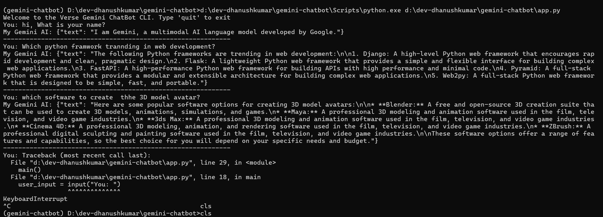

# Gemini AI ChatBot CLI
Engage in conversation with Google's powerful Gemini AI! This Python CLI leverages the `google-generativeai` library for interactive text-based chat using the advanced Gemini-Pro model.

---
### Project Setup Instructions
1. Clone the Project Repository
    ```s
    https://github.com/CodeByDhanush/Python_AI_Projects.git
    ```
2. Setting Up Python Environment
    ```s
    python -m venv gemini-chatbot
    ```
3. Activate the virtual environment
    ```s
    # For Windows
    ./Scripts/activate

    # For macOS/Linux
    source ./bin/activate
    ```
4. Install Python Dependencies
    ```s
    pip install google-generativeai
    ```
5. Get Gemini API Key
    Get your Gemini API key below 👇<br>
    https://aistudio.google.com/app/apikey
<br>
6. Create credentials.ini File
    Create a credentials.ini file in your project directory and add the following:
    ```s
    [gemini_ai]
    API_KEY = xxxxxxxxxxxxxxx
    ```
7. Copy Repository Files <br>
    Copy all files from the repository and paste them into your project directory.
<br>
8. Set Up Target Environment
    Ensure your environment is set up correctly for the application.
<br>
9. Execute the Code
    ```s
    python app.py
    ```
---
## Output Pic
CLI Output Picture:

